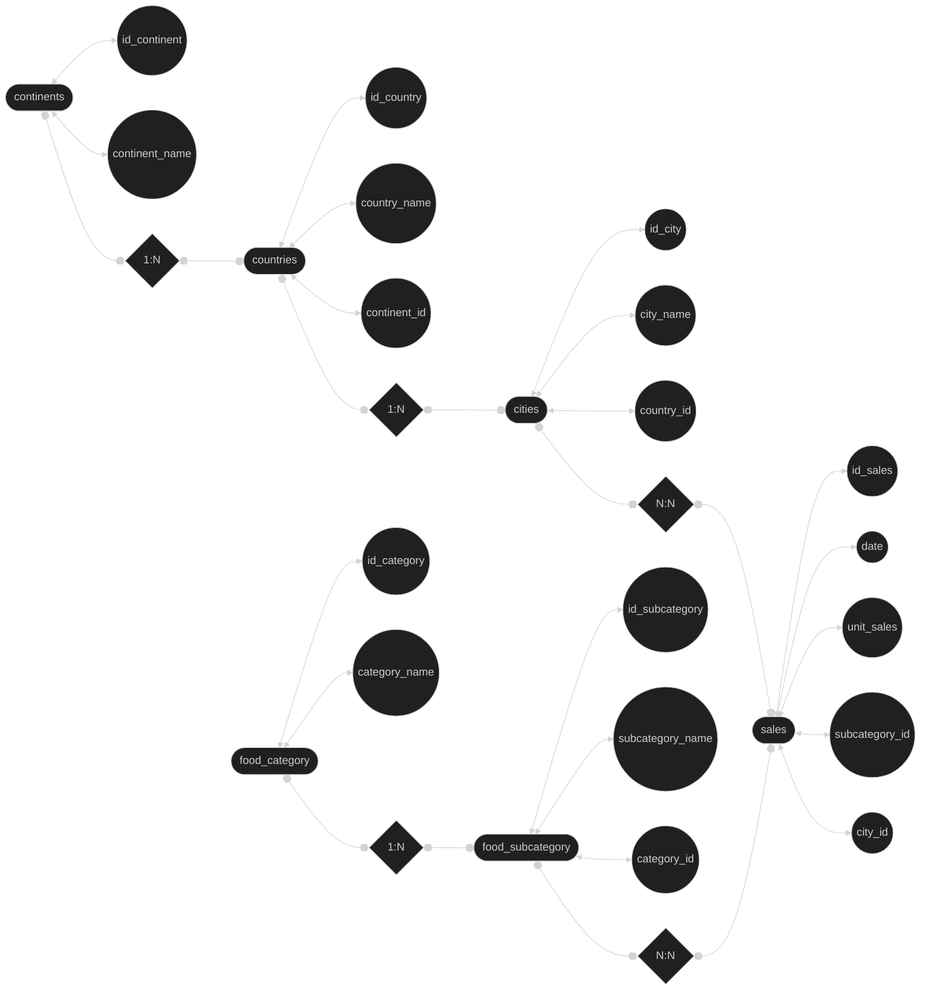

# any-company-global-simoneaa

## Descripción

En este ejercicio se nos pedía crear una tabla en DBeaver a partir de un script proporcionado. A continuación, era necesario normalizar la tabla y generar un diagrama de Chen de la misma, y finalmente crear un script para encontrar el país de la venta con id 3

## Normalización de la tabla

## Diagrama de Chen

**Diagrama original creado con diagrams.net**  

  

**Diagrama adaptado a readme empleando Mermaid**  

